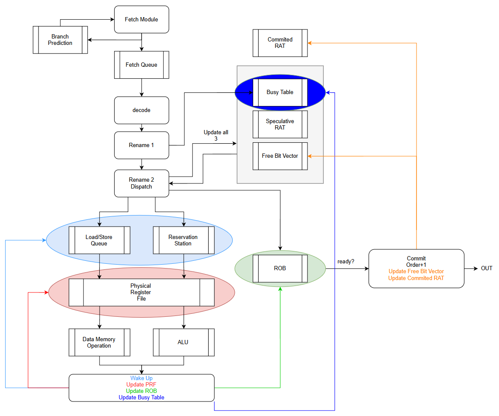

# OOO CPU Design Notes

---

## 1. Overview

Out-of-order execution core targeting RV32I.
Verified using the RTL_TEMPLATE Verilator environment with riscv-formal RVFI checking.

### Design Goals
- Explicit register renaming — eliminate WAR/WAW hazards
- In-order commit — precise architectural state, correct RVFI reporting
- Speculative execution with TAGE branch predictor + BTB
- Single-issue (1-wide) — scalable to multi-issue later
- Commit-time branch recovery
- Deterministic rename timing — free bit vector + priority encoder

---

## 2. Pipeline Overview


```
PC Generator
     ↓
  Fetch         imem_read, imem_addr → magic memory
     ↓
Fetch Queue     8 entries — decouples frontend from backend stalls
     ↓
  Decode        extract opcode/funct3/funct7/rs1/rs2/rd/imm
     ↓
  Rename 1      read SRAT, read PRF source values (for RVFI)
     ↓
  Rename 2      allocate PR / ROB / RS or LSQ, update SRAT, BT, free_bits
  + Dispatch
     ↓
  ┌─────────────────────────────────────────┐
  │ RS: ALU(4) / CMP(2) / Jump(2) / MUL(4) │   LQ(8) / SQ(8) (memory ops)
  └─────────────────────────────────────────┘
     ↓  (out-of-order issue from RS; in-order conservative from LSQ)
  Execute       ALU/CMP/Jump/MUL (1 cycle) / LSU (MEM_DELAY+1 cycles)
     ↓
 Writeback      PRF write, BT clear, ROB update, RS wakeup
     ↓
  Commit        in-order from ROB head; free old_p; update ARAT
```

---

## 3. Structure Sizes

| Structure              | Entries | Index width |
|------------------------|---------|-------------|
| Fetch Queue (FQ)       | 8       | 3 bits      |
| Physical Register File | 64      | 6 bits      |
| Reorder Buffer (ROB)   | 16      | 4 bits      |
| ALU Reservation Station | 4      | 2 bits      |
| CMP Reservation Station | 2      | 1 bit       |
| Jump Reservation Station| 2      | 1 bit       |
| MUL Reservation Station | 4      | 2 bits      |
| Store Queue (SQ)       | 8       | 3 bits      |
| Load Queue (LQ)        | 8       | 3 bits      |
| SRAT / ARAT            | 32      | 5 bits (arch reg index) |
| Busy Table (BT)        | 64      | 6 bits (PRF index)      |
| Free Bit Vector        | 64      | 6 bits (PRF index)      |

---

## 4. Structure Definitions

### 4.1 Fetch Queue Entry

```
FQEntry {
    valid       : 1
    pc          : 32
    inst        : 32
    pred_taken  : 1      // TAGE prediction: 1=taken, 0=not-taken
}
```

FIFO queue. Frontend pushes on successful imem response. Decode pops one per cycle.

---

### 4.2 Physical Register File (PRF)

```
PRF[64] { data : 32 }
```

- p0 is hardwired zero: `PRF[0] = 32'h0`, never written, never allocated.
- No ready bit in PRF — readiness tracked separately in Busy Table.

---

### 4.3 Busy Table (BT)

```
BT[63:0]    // 1 bit per physical register
```

| Value | Meaning |
|-------|---------|
| `BT[p] = 1` | p is in-flight — result not yet written |
| `BT[p] = 0` | p has valid data in PRF |

At reset: `BT = 64'h0` (all ready).
`BT[0]` is always 0 (p0 / x0 is never busy).

---

### 4.4 Free Bit Vector

```
free_bits[63:0]    // 1 bit per physical register
```

| Value | Meaning |
|-------|---------|
| `free_bits[p] = 1` | p is available for allocation |
| `free_bits[p] = 0` | p is currently mapped (in use) |

At reset:
```
free_bits[31:0]  = 0    // p0–p31 mapped to a0–a31 via ARAT/SRAT
free_bits[63:32] = 1    // p32–p63 free
```

**Allocation:** priority encoder selects the lowest-index `1` bit.
**Free at commit:** `free_bits[old_p] = 1` (if `rd_valid`).
**Recovery rebuild:** `free_bits = all 1s`, then `free_bits[ARAT[i]] = 0` for i in 0..31.

---

### 4.5 SRAT and ARAT

```
SRAT[32]   // prf_idx[5:0] for each architectural register a0..a31
ARAT[32]   // prf_idx[5:0] for each architectural register a0..a31
```

At reset: `SRAT[i] = ARAT[i] = i` for i in 0..31.

| Table | Updated by | Represents |
|-------|-----------|------------|
| SRAT  | Rename 2 (every dispatch) | Speculative state |
| ARAT  | Commit (when `rd_valid`) | Committed architectural state |

---

### 4.6 Reorder Buffer (ROB)

Circular FIFO. `head` = next to commit. `tail` = next empty slot.

```
ROBEntry {
    // Bookkeeping
    valid           : 1
    done            : 1      // set at writeback when execution completes

    // Register rename
    rd_valid        : 1      // instruction writes rd AND rd != x0
    rd_arch         : 5      // architectural destination register index
    new_p           : 6      // physical register allocated at rename
    old_p           : 6      // physical register previously mapped to rd_arch

    // RVFI — captured at Rename 1 / Rename 2
    pc              : 32
    inst            : 32
    rs1_addr        : 5
    rs2_addr        : 5
    rs1_rdata       : 32     // PRF[src0_tag] read at Rename 1; 0 if rs1 not used
    rs2_rdata       : 32     // PRF[src1_tag] read at Rename 1; 0 if rs2 not used

    // RVFI — written at Writeback
    rd_wdata        : 32     // ALU result or load data; 0 if rd_valid=0

    // RVFI — written at Execute (loads and stores only; 0 otherwise)
    mem_addr        : 32
    mem_rmask       : 4
    mem_wmask       : 4
    mem_rdata       : 32     // filled when load completes
    mem_wdata       : 32     // filled when store address+data are computed

    // Branch — set at Decode/Dispatch; resolved at Writeback
    is_branch            : 1   // instruction is a conditional branch
    is_jump              : 1   // instruction is JAL or JALR
    pred_taken           : 1   // prediction from TAGE at fetch time
    mispredict           : 1   // resolved_taken != pred_taken OR target mismatch
    target_pc            : 32  // resolved correct PC; 0 at dispatch, written at writeback
    branch_actual_taken  : 1   // actual branch outcome (written at writeback by CMP/Jump)
}
```

Total: ~330 bits per entry × 16 entries.

---

### 4.7 Reservation Stations (RS)

There are four separate RS, one per functional unit. Memory instructions go to LQ/SQ directly.

| RS       | Size | Instructions         |
|----------|------|----------------------|
| ALU RS   | 4    | ADD, SUB, LUI, AUIPC, ADDI, etc. |
| CMP RS   | 2    | BEQ, BNE, BLT, BGE, BLTU, BGEU |
| Jump RS  | 2    | JAL, JALR            |
| MUL RS   | 4    | MUL, MULH, DIV, REM, etc. (M-ext) |

All RS share the same entry structure:

```
RSEntry {
    valid       : 1
    rob_idx     : 4

    src0_valid  : 1          // instruction reads rs1
    src0_tag    : 6          // physical register for rs1
    src0_ready  : 1          // ~BT[src0_tag] at dispatch, OR src0_valid=0

    src1_valid  : 1          // instruction reads rs2
    src1_tag    : 6          // physical register for rs2
    src1_ready  : 1          // ~BT[src1_tag] at dispatch, OR src1_valid=0

    dest_valid  : 1          // instruction writes rd
    dest_tag    : 6          // new_p allocated at rename

    // Plus full ROB_t and MIDCORE_t snapshots for execution
}
```

---

### 4.8 Store Queue Entry (SQ)

```
SQEntry {
    valid       : 1
    rob_idx     : 4

    addr_ready  : 1          // base address source (rs1) is ready in PRF
    addr_tag    : 6          // physical register for rs1 (base)
    addr_value  : 32         // computed: PRF[addr_tag] + s_imm

    data_ready  : 1          // store data source (rs2) is ready in PRF
    data_tag    : 6          // physical register for rs2 (store data)
    data_value  : 32         // captured from PRF[data_tag]

    wmask       : 4          // byte enables (sb=0001, sh=0011, sw=1111 shifted)
    committed   : 1          // set by commit — store may now write dmem
}
```

---

### 4.9 Load Queue Entry (LQ)

```
LQEntry {
    valid       : 1
    rob_idx     : 4

    addr_ready  : 1          // base address source (rs1) is ready in PRF
    addr_tag    : 6          // physical register for rs1 (base)
    addr_value  : 32         // computed: PRF[addr_tag] + i_imm

    rmask       : 4          // byte enables

    dest_tag    : 6          // new_p — load result written here at writeback
    issued      : 1          // load has been sent to dmem
    done        : 1          // load data has returned and been written to PRF/ROB
}
```

---

## 5. Operation Encoding

### ALU op (4-bit, `alu_ops` enum in types.sv)

| Value    | Operation |
|----------|-----------|
| 4'b0000  | ADD       |
| 4'b1000  | SUB       |
| 4'b0001  | SLL       |
| 4'b0010  | SLT       |
| 4'b0011  | SLTU      |
| 4'b0100  | XOR       |
| 4'b0101  | SRL       |
| 4'b1101  | SRA       |
| 4'b0110  | OR        |
| 4'b0111  | AND       |

### Dispatch routing (`dispatch_to` field, set at Decode)

| Value | Functional Unit | Instructions |
|-------|----------------|--------------|
| 0     | ALU RS         | op_reg, op_imm, op_lui, op_auipc |
| 1     | CMP RS         | op_br (conditional branches) |
| 2     | LQ             | op_load |
| 3     | SQ             | op_store |
| 4     | Jump RS        | op_jal |
| 5     | Jump RS        | op_jalr |
| 6     | MUL RS         | op_reg with funct7=7'h01 (M-ext) |

Memory instructions go directly to LQ/SQ — no ALU RS involved.
Access size (byte/half/word) determined by funct3, stored in rmask/wmask.

---

## 6. Reset State

```
pc              = 32'h60000000
ARAT[i]         = i     for i in 0..31
SRAT[i]         = i     for i in 0..31
free_bits       = 64'hFFFFFFFF_00000000   // p32–p63 free
BT              = 64'h0                   // all ready
PRF[0]          = 32'h0                   // x0 hardwired zero
ROB             : head=0, tail=0, all valid=0
RS              : all valid=0
SQ              : all valid=0
LQ              : all valid=0
FQ              : empty
```

---

## 7. Stage-by-Stage Operation

### 7.1 Fetch

```
imem_addr = pc
imem_read = 1

// Branch prediction (combinational, zero latency)
btb_hit, btb_target = BTB.lookup(pc)
pred_taken          = TAGE.lookup(pc)        // MSB of TAGE counter
branch_valid        = btb_hit && pred_taken

on imem_resp:
    push FQEntry { pc, imem_rdata, pred_taken }
    if (branch_valid):
        pc = btb_target    // redirect to predicted target
    else:
        pc = pc + 4
```

Fetch stalls if FQ is full (freeze).
Branch recovery overrides PC with `recover_pc` from commit stage (Section 9).
TAGE FIFO push is gated on `imem_resp && btb_hit` — only tracks BTB-hit fetches.

---

### 7.2 Decode

Pop one entry from FQ. Extract:

```
opcode, funct3, funct7
rs1, rs2, rd
rs1_valid, rs2_valid
rd_valid = (rd != 0) && instruction_writes_rd
imm  (sign-extended, appropriate format: I/S/B/U/J)
is_branch, is_load, is_store
op   (for RS encoding)
```
Send request to SRAT for rs1, rs2, rd.
Pass to Rename 1.

---

### 7.3 Rename 1

Read SRAT and PRF. No writes this cycle.

```
src0_tag  = SRAT[rs1]          // physical register for rs1
src1_tag  = SRAT[rs2]          // physical register for rs2
old_pr    = SRAT[rd]           // will be freed at commit (if rd_valid)

// Capture source values for RVFI (Option B — store in ROB)
rs1_rdata = rs1_valid ? PRF[src0_tag] : 0
rs2_rdata = rs2_valid ? PRF[src1_tag] : 0

// Read busy bits for source readiness check in Rename 2
src0_busy = rs1_valid ? BT[src0_tag] : 0
src1_busy = rs2_valid ? BT[src1_tag] : 0
```
send request to BT[src_tag1], BT[src_tag2]. 
Output to Rename 2: all decoded signals + src0_tag, src1_tag, old_pr,
rs1_rdata, rs2_rdata, src0_busy, src1_busy.

---

### 7.4 Rename 2 + Dispatch

#### Stall condition

Stall (hold Rename 1 output, back-pressure decode and fetch) if ANY of:

| Condition | Cause |
|-----------|-------|
| ROB full | `(tail+1)%16 == head` |
| RS full | non-memory instruction, all RS entries valid |
| SQ full | store instruction, all SQ entries valid |
| LQ full | load instruction, all LQ entries valid |
| `free_bits == 0` | no free physical register (only if `rd_valid`) |

All resources must be available in the same cycle or the instruction does not dispatch.

#### When not stalling

```
// 1. Allocate physical register (if rd_valid)
if (rd_valid):
    new_pr          = priority_encode(free_bits)   // lowest free index
    free_bits[new_pr] = 0
    BT[new_pr]      = 1
    SRAT[rd]        = new_pr

// 2. Compute source readiness for RS entry
src0_ready = ~src0_busy || ~rs1_valid
src1_ready = ~src1_busy || ~rs2_valid

// 3. Push ROB entry
ROB[tail] = {
    valid=1, done=0,
    rd_valid, rd_arch=rd, new_p=new_pr, old_p=old_pr,
    pc, inst,
    rs1_addr=rs1, rs2_addr=rs2,
    rs1_rdata, rs2_rdata,
    rd_wdata=0,
    mem_addr=0, mem_rmask=0, mem_wmask=0, mem_rdata=0, mem_wdata=0,
    is_branch, is_jump, pred_taken,    // pred_taken from fetch-time TAGE
    mispredict=0, target_pc=0, branch_actual_taken=0
}
rob_idx = tail
tail = (tail + 1) % 16

// 4. Dispatch to RS or LSQ
if (is_store):
    SQ[sq_tail] = {
        valid=1, rob_idx,
        addr_ready=src0_ready, addr_tag=src0_tag, addr_value=0,
        data_ready=src1_ready, data_tag=src1_tag, data_value=0,
        wmask=computed_wmask, committed=0
    }
    if (src0_ready): addr_value = PRF[src0_tag] + s_imm   // capture now
    if (src1_ready): data_value = PRF[src1_tag]            // capture now
    sq_tail = (sq_tail + 1) % 8

else if (is_load):
    LQ[lq_tail] = {
        valid=1, rob_idx,
        addr_ready=src0_ready, addr_tag=src0_tag, addr_value=0,
        rmask=computed_rmask,
        dest_tag=new_pr, issued=0, done=0
    }
    if (src0_ready): addr_value = PRF[src0_tag] + i_imm   // capture now
    lq_tail = (lq_tail + 1) % 8

else:
    RS[free_slot] = {
        valid=1, op, imm, rob_idx,
        src0_valid=rs1_valid, src0_tag, src0_ready,
        src1_valid=rs2_valid, src1_tag, src1_ready,
        dest_valid=rd_valid, dest_tag=new_pr
    }
```

---

### 7.5 Issue — Wakeup and Select

#### Wakeup (every writeback)

When a writeback broadcasts tag `T`:

```
// RS wakeup
for each RS entry i with valid=1:
    if src0_valid[i] && src0_tag[i] == T:
        src0_ready[i] = 1
    if src1_valid[i] && src1_tag[i] == T:
        src1_ready[i] = 1

// LQ wakeup — address source ready
for each LQ entry i with valid=1 && !addr_ready[i]:
    if addr_tag[i] == T:
        addr_ready[i] = 1
        addr_value[i] = PRF[T] + i_imm[i]   // compute address immediately

// SQ wakeup — address and data sources
for each SQ entry i with valid=1:
    if !addr_ready[i] && addr_tag[i] == T:
        addr_ready[i] = 1
        addr_value[i] = PRF[T] + s_imm[i]
    if !data_ready[i] && data_tag[i] == T:
        data_ready[i] = 1
        data_value[i] = PRF[T]
```

#### Select — RS (ALU/Branch)

Among all RS entries with `valid=1 AND src0_ready=1 AND src1_ready=1`:
- **Policy:** select lowest valid index (simplest, acceptable for single-issue)
- Issue selected entry to ALU
- Clear `RS[selected].valid = 0`

#### Select — LSQ (Loads)

For the oldest LQ entry (lowest rob_idx) with `valid=1 AND addr_ready=1 AND !issued`:

1. Walk all SQ entries with valid=1 and older rob_idx:
   - If any SQ entry has `addr_ready=0` → **stall, do not issue** (in-order conservative policy)
   - If any SQ entry has `addr_ready=1 AND addr_value == LQ.addr_value AND data_ready=1`
     → **forward from SQ**: skip dmem, use SQ data_value directly
   - If all older SQ entries have `addr_ready=1` and none match → **issue to dmem**

2. On issue: set `LQ[i].issued = 1`

#### Select — LSQ (Stores)

Committed SQ entries (committed=1, addr_ready=1, data_ready=1) write to dmem
in FIFO order from SQ head. This happens independently of the ROB — stores drain
from SQ after commit sets the committed flag.

---

### 7.6 Execute

#### ALU (1 cycle)

Computes result from src0, src1 (or immediate), op.

For branches:
```
resolved_taken  = evaluate branch condition (BEQ, BNE, BLT, BGE, BLTU, BGEU)
resolved_target = pc + b_imm    // conditional branch target
                  pc + j_imm    // JAL
                  (rs1 + i_imm) & ~1   // JALR
mispredict = (resolved_taken != pred_taken)
             || (resolved_target != (pc+4))    // for unconditional: always mispredicts
```

For LUI: `result = u_imm`
For AUIPC: `result = pc + u_imm`
For JAL/JALR: `result = pc + 4` (link address written to rd)

#### LSU (MEM_DELAY+1 cycles)

Address already computed in LQ/SQ at wakeup time.
Load: issue `dmem_addr = addr_value`, `dmem_read = 1`, `dmem_rmask = rmask`.
Store (at drain): issue `dmem_addr = addr_value`, `dmem_write = 1`, `dmem_wmask = wmask`, `dmem_wdata = data_value`.

---

### 7.7 Writeback

When ALU or LSU completes:

```
// Write result to PRF
PRF[dest_tag] = result

// Clear busy bit
BT[dest_tag] = 0

// Update ROB
ROB[rob_idx].done     = 1
ROB[rob_idx].rd_wdata = result          // if rd_valid

// Branch/Jump: record misprediction, resolved PC, and actual outcome
if (is_branch || is_jump):
    ROB[rob_idx].mispredict           = mispredict
    ROB[rob_idx].target_pc            = resolved_target
    ROB[rob_idx].branch_actual_taken  = br_en   // CMP: branch condition result; Jump: always 1

// Load: record RVFI memory fields
if (is_load):
    ROB[rob_idx].mem_addr   = addr_value
    ROB[rob_idx].mem_rmask  = rmask
    ROB[rob_idx].mem_rdata  = dmem_rdata

// Store: record RVFI memory fields (address+data resolved)
if (is_store):
    ROB[rob_idx].mem_addr   = addr_value
    ROB[rob_idx].mem_wmask  = wmask
    ROB[rob_idx].mem_wdata  = data_value

// Wakeup: broadcast dest_tag to RS, LQ, SQ
broadcast(dest_tag)

// Free RS entry (already done at issue)
```

---

### 7.8 Commit

Each cycle, if `ROB[head].valid=1 AND ROB[head].done=1`:

```
// Free old physical register
if (rd_valid):
    free_bits[old_p] = 1
    ARAT[rd_arch]    = new_p

// Allow store to drain to memory
if (is_store):
    find SQ entry with rob_idx == head, set committed = 1

// Advance ROB head
ROB[head].valid = 0
head = (head + 1) % 16

// Fire RVFI
monitor_valid = 1
(see Section 10 for full RVFI assignments)

// Check for branch misprediction AFTER committing
// (ARAT and free_bits already reflect this instruction's commit)
if (mispredict):
    trigger branch recovery (Section 9)
```

---

## 8. Store Drain

After commit sets `SQ[i].committed = 1`, the LSU drains from `sq_head`:

```
while SQ[sq_head].valid
   && SQ[sq_head].committed
   && SQ[sq_head].addr_ready
   && SQ[sq_head].data_ready:

    dmem_addr  = SQ[sq_head].addr_value
    dmem_write = 1
    dmem_wmask = SQ[sq_head].wmask
    dmem_wdata = SQ[sq_head].data_value

    SQ[sq_head].valid = 0
    sq_head = (sq_head + 1) % 8
```

One store drains per cycle (single dmem write port).

---

## 9. Branch Recovery (Commit-Time)

Triggered immediately after committing a ROB entry with `mispredict=1`.

```
// 1. Flush all pipeline structures
FQ:  clear (empty)
ROB: head=0, tail=0, all valid=0
RS:  all valid=0
LQ:  all valid=0, lq_head=0, lq_tail=0
SQ:  all valid=0, sq_head=0, sq_tail=0
BT:  BT = 64'h0   // all committed registers have valid data

// 2. Rebuild free bit vector from ARAT
free_bits = 64'hFFFF_FFFF_FFFF_FFFF    // start: all free
for i in 0..31:
    free_bits[ARAT[i]] = 0             // ARAT-mapped regs are in use

// 3. Restore speculative RAT to committed state
SRAT = ARAT

// 4. Redirect fetch to correct PC
pc = target_pc    // resolved target from the mispredicted branch's ROB entry
```

**Note:** The mispredicted branch itself has already committed before recovery runs —
ARAT and free_bits already reflect its `rd_valid` update.
`target_pc` in the ROB entry was written at Writeback.

---

## 10. RVFI Reporting

Fires at commit (same cycle as ROB head advance):

```
monitor_valid       = 1
monitor_order       = commit_counter++    // monotonically increasing
monitor_inst        = ROB[head].inst
monitor_pc_rdata    = ROB[head].pc
monitor_pc_wdata    = ROB[head].mispredict ? ROB[head].target_pc : (ROB[head].pc + 4)
monitor_rs1_addr    = ROB[head].rs1_addr
monitor_rs2_addr    = ROB[head].rs2_addr
monitor_rs1_rdata   = ROB[head].rs1_rdata
monitor_rs2_rdata   = ROB[head].rs2_rdata
monitor_rd_addr     = ROB[head].rd_valid ? ROB[head].rd_arch : 5'd0
monitor_rd_wdata    = ROB[head].rd_wdata
monitor_mem_addr    = ROB[head].mem_addr
monitor_mem_rmask   = ROB[head].mem_rmask
monitor_mem_wmask   = ROB[head].mem_wmask
monitor_mem_rdata   = ROB[head].mem_rdata
monitor_mem_wdata   = ROB[head].mem_wdata
```

For non-memory instructions: `mem_addr/rmask/wmask/rdata/wdata = 0`.

**Special cases for `pc_wdata`:**

| Instruction | Condition | pc_wdata |
|-------------|-----------|----------|
| Non-branch/jump | — | pc + 4 |
| Conditional branch not taken | correctly predicted | pc + 4 |
| Conditional branch taken | correctly predicted | target_pc |
| Any branch/jump | mispredicted | target_pc |
| JAL/JALR | BTB hit + correct prediction | target_pc (no mispredict) |
| JAL/JALR | BTB miss or wrong prediction | target_pc (mispredict → recovery) |

---

## 11. Design Decisions and Rationale

### Free Bit Vector (not FIFO Free List)
Branch recovery requires rebuilding the free list from ARAT state. With a bit vector this
is trivial: set all bits to 1, then clear the 32 bits corresponding to ARAT-mapped physical
registers. A FIFO free list would require draining and refilling on every recovery.
The priority encoder on the rename critical path is acceptable for single-issue 1-wide.

### Commit-Time Branch Recovery (not Execute-Time)
Execute-time recovery flushes the ROB/RS/LSQ the moment a branch resolves, reducing
wasted work. Commit-time recovery defers all recovery logic to the commit stage, which
is simpler and keeps writeback clean. The tradeoff is that instructions younger than the
mispredicted branch continue to execute until the branch commits. Acceptable for a first
implementation.

### Dual RAT (SRAT + ARAT)
SRAT is updated speculatively every rename cycle. ARAT is updated only at commit.
On recovery, `SRAT = ARAT` restores committed architectural state in one cycle
without storing RAT checkpoints at every branch.

### RVFI Data Stored in ROB (Option B)
All RVFI fields are captured at rename (source values) and writeback (result, memory
fields). At commit the ROB entry has everything needed for RVFI reporting without
reading the PRF or other structures. Cost: ~330 bits per ROB entry vs ~50 minimal.
Benefit: commit stage is simple and self-contained.

### In-Order Conservative Load/Store
Loads wait until all older SQ entries have `addr_ready=1` before issuing to memory.
This avoids memory ordering violations and eliminates the need for a violation
detection and replay mechanism. Stores commit the actual memory write only after
the ROB commits the store instruction (committed flag in SQ).

### TAGE Branch Predictor + BTB
Frontend uses a TAGE (TAgged GEometric history length) predictor combined with a BTB
(Branch Target Buffer). TAGE maintains one bimodal base table (T0, 128 entries) and four
tagged tables (T1–T4, 64 entries each) with geometrically increasing history lengths.
The BTB (16 sets, direct-mapped) provides branch targets. A prediction is only acted on
when both BTB hits and TAGE predicts taken (`branch_valid = btb_hit && branch_taken`).

TAGE update feedback comes from commit: `update_valid = commit_is_branch || commit_is_jump`.
A 16-entry FIFO carries per-fetch metadata (which TAGE table/entry made the prediction)
from fetch to commit. PC-matching at pop time (`data_o.pc == commit_pc`) ensures the FIFO
entry corresponds to the correct branch, tolerating BTB-miss branches that were never pushed.
On mispredict, the FIFO is flushed (`wrPtr = rdPtr`) and the mispredicting branch's entry
is still used for training before the flush.

---

## 12. Known Limitations and Future Work

| Limitation | Impact | Future Fix |
|------------|--------|------------|
| Commit-time branch recovery | Full ROB depth wasted after misprediction | Execute-time recovery |
| TAGE FIFO uses BTB-hit as push gate | BTB-miss branches not trained in tagged tables; falls back to T0 bimodal | ROB-indexed TAGE metadata storage |
| Small TAGE tables (T0=128, T1-T4=64) | Aliasing on dense branch workloads (e.g. coremark) | Larger tables, better hash functions |
| Single-issue | One instruction/cycle max | 2-wide with intra-group rename bypass |
| In-order conservative LSQ | Loads blocked by any unresolved older store address | Speculative loads with violation detection |
| No instruction cache | Uses RTL_TEMPLATE magic memory | Add I$/D$ with configurable latency |
| No exception handling | Illegal instructions undefined behavior | Precise exception model with ROB exception bits |
| No CSR support | No FENCE, ECALL, EBREAK, etc. | Add CSR file and privileged mode |
